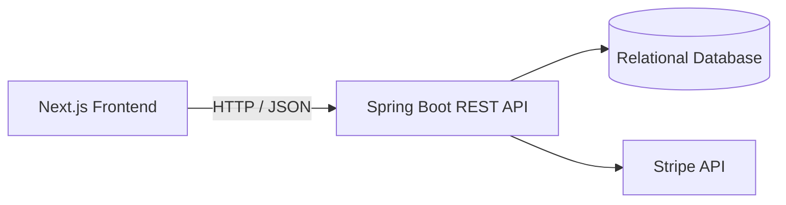
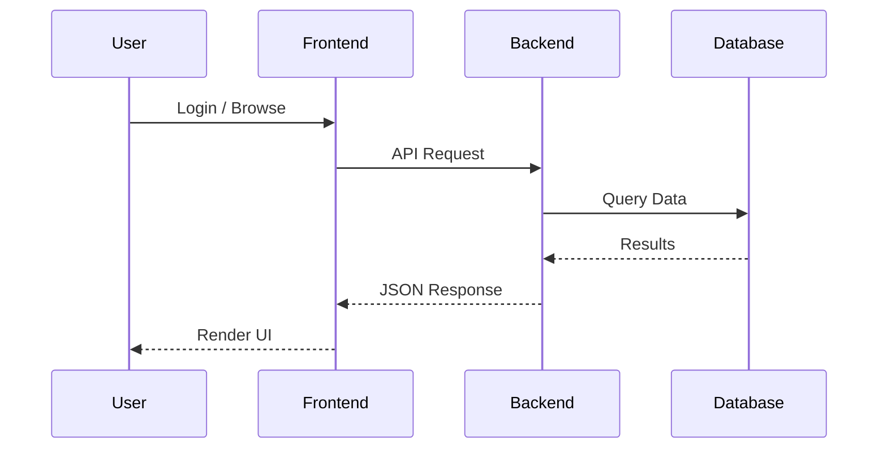
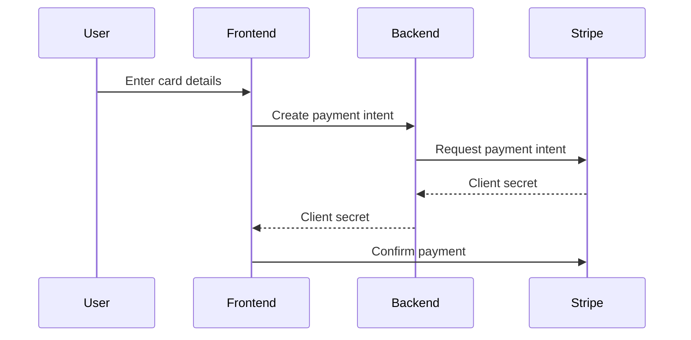

# 🛒 Voltex – Full-Stack E-Commerce Platform


Voltex is a **full-stack e-commerce platform** built using **Next.js** for the frontend and **Spring Boot** for the backend.  
It includes authentication, product management, order lifecycle tracking, payment integration, and warehouse/inventory monitoring through a modular dashboard.

---

## 🧭 System Architecture



---

## 📁 Project Structure

```text
voltex/
│
├── ecommerce-frontend/                # Next.js frontend application
│   ├── public/                        # Static assets
│   │
│   ├── src/
│   │   ├── app/                       # App Router pages & layouts
│   │   │   ├── layout.js              # Root layout
│   │   │   ├── page.js                # Landing / login page
│   │   │   │
│   │   │   └── dashboard/             # Admin dashboard routes
│   │   │       ├── layout.js
│   │   │       ├── page.js            # Overview dashboard
│   │   │       ├── products/page.js
│   │   │       ├── orders/page.js
│   │   │       ├── cart/page.js
│   │   │       ├── users/page.js
│   │   │       ├── payments/page.js
│   │   │       ├── shipments/page.js
│   │   │       ├── inventory/page.js
│   │   │       └── warehouse/page.js
│   │   │
│   │   └── components/                # Reusable React components
│   │       └── Navbar.js
│   │
│   ├── tailwind.config.js
│   ├── next.config.js
│   ├── postcss.config.js
│   └── package.json
│
├── ecommerce-backend/                 # Spring Boot backend service
│   │
│   ├── src/main/java/
│   │   └── com/voltex/
│   │       ├── controller/            # REST controllers
│   │       ├── service/               # Service interfaces
│   │       ├── service/impl/          # Service implementations
│   │       ├── repository/            # JPA repositories
│   │       ├── entity/                # Database entities
│   │       ├── dto/                   # Request/response DTOs
│   │       └── config/                # Security & configuration
│   │
│   ├── src/main/resources/
│   │   ├── application.properties
│   │   └── static/
│   │
│   ├── src/test/java/
│   ├── pom.xml
│   ├── mvnw
│   └── mvnw.cmd
│
└── README.md
```

---

## 📌 Important Routes

```text
/                       → Landing / Login
└── /dashboard          → Admin Overview
    ├── /dashboard/products
    ├── /dashboard/orders
    ├── /dashboard/cart
    ├── /dashboard/users
    ├── /dashboard/payments
    ├── /dashboard/shipments
    ├── /dashboard/inventory
    └── /dashboard/warehouse
```

---

## 🚀 Tech Stack

### Frontend
- Next.js 14 (App Router)
- React 18
- Tailwind CSS
- NextAuth.js
- Stripe.js

### Backend
- Spring Boot
- Spring Data JPA
- Hibernate
- Maven

### Database
- MySQL / PostgreSQL

---

## ⚙️ Running the Project

### 1. Clone Repository

```bash
git clone https://github.com/SohamB1810/voltex.git
cd voltex
```

---

### 2. Run Backend

```bash
cd ecommerce-backend
mvn spring-boot:run
```

Backend runs on:
```
http://localhost:8080
```

---

### 3. Run Frontend

```bash
cd ecommerce-frontend
npm install
npm run dev
```

Frontend runs on:
```
http://localhost:3000
```

---

## 🔐 Environment Variables

### Frontend `.env.local`

```env
NEXT_PUBLIC_API_URL=http://localhost:8080
NEXTAUTH_SECRET=your_secret
NEXTAUTH_URL=http://localhost:3000
NEXT_PUBLIC_STRIPE_PUBLISHABLE_KEY=pk_test_xxx
```

### Backend `application.properties`

```properties
spring.datasource.url=jdbc:mysql://localhost:3306/voltex
spring.datasource.username=root
spring.datasource.password=yourpassword

spring.jpa.hibernate.ddl-auto=update
server.port=8080
```

---

## 🔌 API Flow



---

## 💳 Payment Flow (Stripe)



---

## 🎯 Features

- Admin dashboard
- Product CRUD operations
- Order lifecycle tracking
- Shipment monitoring
- Inventory & warehouse management
- JWT authentication
- Stripe payment integration

---

## 📦 Production Build

### Backend

```bash
mvn clean package
java -jar target/*.jar
```

### Frontend

```bash
npm run build
npm start
```

---

## 👨‍💻 Author

**Soham Biswas**  
GitHub: https://github.com/SohamB1810

---

## 📄 License

This project is licensed under the MIT License.
